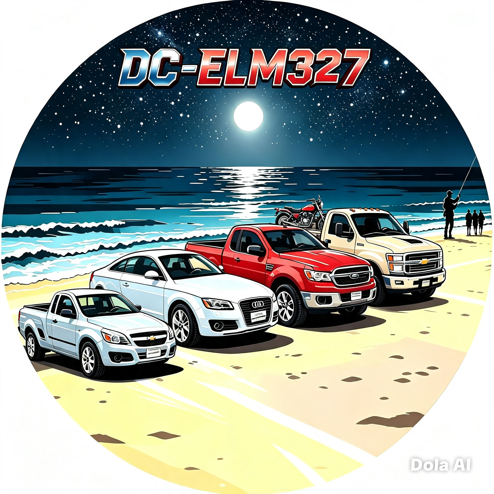

<p align="center">
  <a href="https://github.com/dcg0/DC-ELM327/actions/workflows/security.yml"></a>
  <a href="https://github.com/dcg0/DC-ELM327/security"></a>
</p>

<div align="center">



# 🔌 DC-ELM327
### Diagnóstico Automotriz OBD-II — En tu celular


> 🚗 Sensores en tiempo real • 📊 Gráficas dinámicas  
> 🔧 Lectura y borrado de códigos de falla  
> 📄 Exportación CSV • 📡 Bluetooth / BLE / USB / Wi-Fi

---

## ⬇️ Descargar APK — Última Versión

### 📥 v2.7.10-debug
**[⬇️ DC-ELM327-debug.apk](https://github.com/dcg0/DC-ELM327/releases/download/v2.7.10-debug/DC-ELM327-debug.apk)**

- 📦 Tamaño: 6.19 MB
- 📱 Android 9.0 o superior
- ✅ Firmada para pruebas
- 🔗 [Ver en Publicaciones / Releases](https://github.com/dcg0/DC-ELM327/releases/latest)

> ⚠️ Esta versión está firmada con clave de depuración. Para producción o Google Play, genera tu propia firma de lanzamiento.

</div>

---

## 📋 ¿Qué es DC-ELM327?

**DC-ELM327** es una aplicación Android que convierte tu celular en un escáner automotriz completo. Al conectar un adaptador **ELM327** al puerto OBD de tu vehículo, obtienes todos los datos de la computadora del auto en tiempo real.

> ✅ Incluye **Modo Demo** — prueba todo sin necesidad de tener el adaptador o el auto conectado.

---

## ✅ Características

- ✅ Conexión por **Bluetooth clásico, BLE, USB y Wi-Fi/red**
- ✅ Lectura y borrado de códigos de avería (DTC) con descripción
- ✅ Datos en vivo, selección de PIDs y gráficas dinámicas
- ✅ Vista de tablero, HUD y dashboard WebView
- ✅ Información del vehículo, freeze frames y pruebas de control
- ✅ Guardar/cargar mediciones y **exportar a CSV**
- ✅ Modo Demo completo
- ✅ Configuración de unidades, modo día/noche, pantalla completa
- ✅ Soporte para plugins
- ✅ Interfaz en varios idiomas

> 💡 La comunicación real depende de un adaptador ELM327 compatible y los permisos de Bluetooth/USB/red del dispositivo.

---

## 📱 Requisitos

- Android 9.0 o superior
- Adaptador ELM327 compatible (Bluetooth recomendado)
- Permisos de Bluetooth y Ubicación habilitados

## 🔧 Instalación

1. Descarga `DC-ELM327-debug.apk` desde el enlace de arriba
2. Permite **instalar aplicaciones de fuentes desconocidas**
3. Abre la app → elige tu tipo de conexión
4. Empareja tu módulo ELM327 por Bluetooth → **Conectar** ✅
5. Sin auto → selecciona **Modo Demo** para probar todo

---

## 🛠️ Para desarrolladores — Compilar desde el código

### Requisitos
- **JDK 17** (incluye `javac`)
- **Android SDK Platform 36** + Build Tools 36.0.0
- Gradle Wrapper incluido

### Comandos
```bash
chmod +x gradlew
./gradlew clean test assembleDebug
